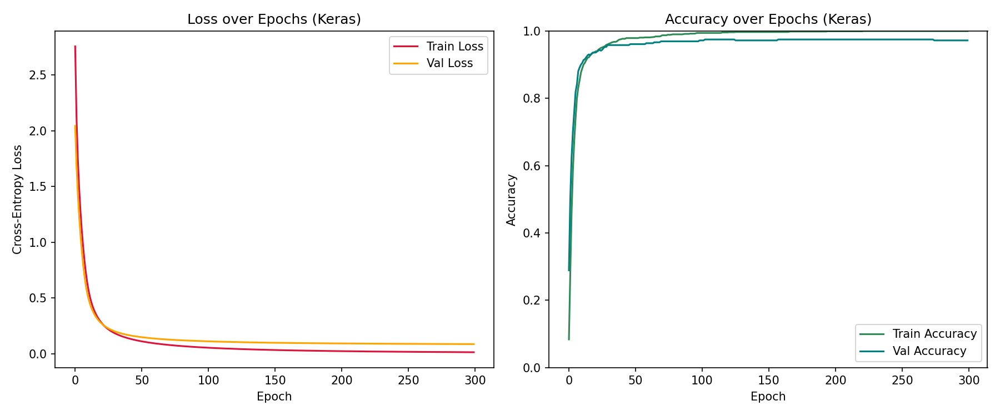
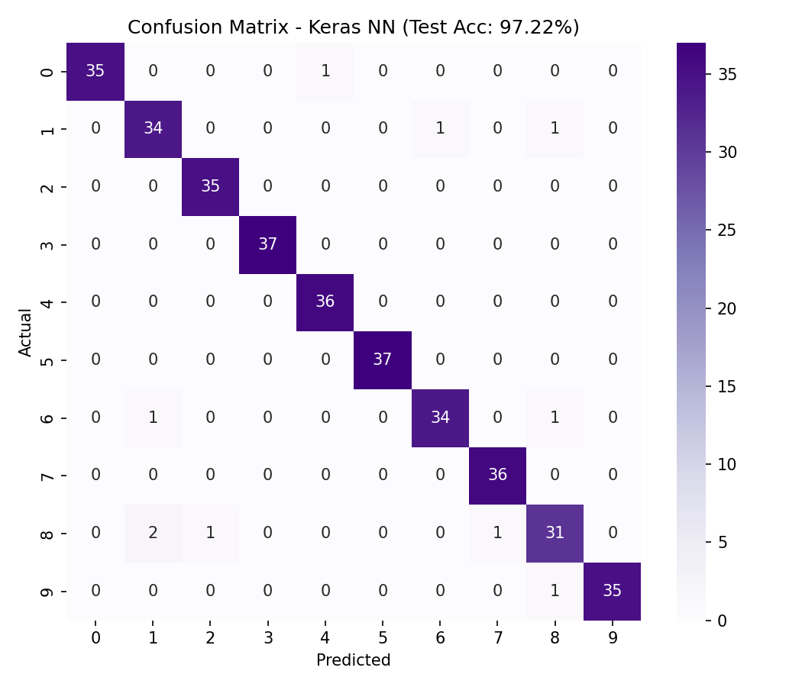
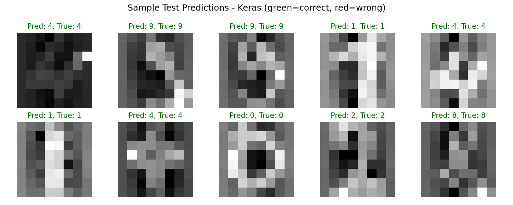

# Day 17 – Neural Network with TensorFlow/Keras

Part of my **#75DaysOfCode** challenge — Deep Learning Basics, NN Experiment #2.

## Goal

Rebuild the same digit classifier from **Day 16** (a from-scratch NumPy neural
network) using **TensorFlow/Keras**, to directly compare how much boilerplate a
deep learning framework saves — automatic differentiation, built-in optimizers,
and training loops — versus writing forward/backward passes by hand.

## Setup

| | |
|---|---|
| **Architecture** | 64 (input) → 32 (hidden, ReLU) → 10 (output, softmax) — identical to Day 16 |
| **Dataset** | `sklearn.datasets.load_digits` — 1,797 8×8 handwritten digit images |
| **Optimizer** | SGD, learning rate 0.5 |
| **Loss** | Sparse categorical cross-entropy |
| **Training** | 300 epochs, full-batch gradient descent |

## Results

- **Final test accuracy: 97.22%**
- **Trainable parameters:** 2,410
- Training accuracy reaches 100% by ~epoch 240, with validation loss flattening
  around 0.08–0.10 — a small generalization gap but no serious overfitting at
  this scale.

| Loss & Accuracy Curves | Confusion Matrix |
|---|---|
|  |  |



## Keras vs. NumPy from scratch (Day 16)

Using the same architecture, data split, optimizer, and hyperparameters, this
version required no manual implementation of forward propagation, backpropagation,
weight updates, or a training loop — `model.compile()` and `model.fit()` replace
all of that. It's a good way to *feel* what a framework buys you after having
written the raw math by hand on Day 16.

## Run it

```bash
pip install -r requirements.txt
python day17_keras_nn.py
```

This prints training progress, a classification report, and saves three plots
(`training_curves_keras.png`, `confusion_matrix_keras.png`,
`sample_predictions_keras.png`) to the working directory.

## Files

```
day17_keras_nn.py           # main script
requirements.txt            # dependencies
training_curves_keras.png   # loss & accuracy over epochs
confusion_matrix_keras.png  # per-digit confusion matrix
sample_predictions_keras.png# sample test predictions
```

---
Author: **Rudra** ([@Ruddy2310](https://github.com/Ruddy2310))
